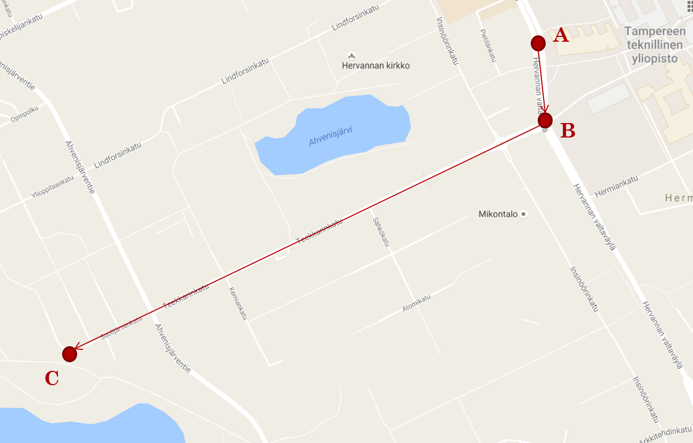
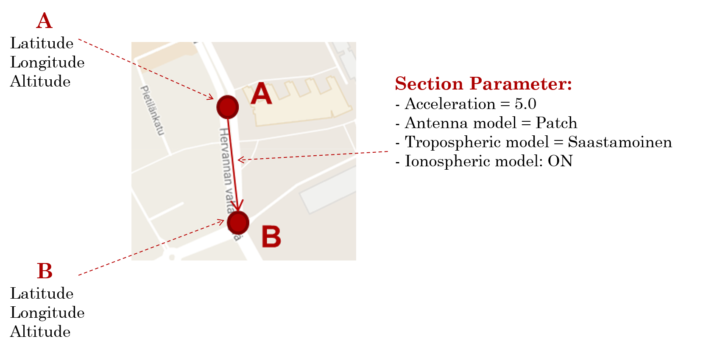
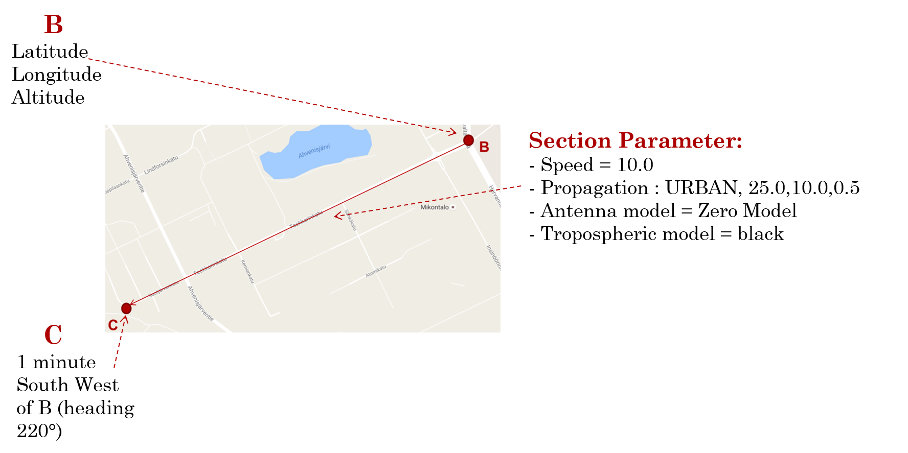

===================
Define the scenario
===================

There is already some scenario define in data/scenariotest but you can also define your own
scenario

Scenarios already define
------------------------

6 scenarios have been defined for you to test your devices:

- test_1:
This is the static case, for a minute, data are taken from your simulator and/or your
receiver(s).

- test_2:
This is the temporal square test, the simulator run a path representing a square at constant speed
, each section last a minute. It basically test if the receiver(s) is well responding to a brutal
change of direction.

- test_3:
This is the temporal circle test, the simulator run a path representing a circle at constant
speed, during 2 minutes.

- test_4:
This is the test of constant acceleration in straight line.

- test_5:
This is the sensitivity test, staying static, the C/N0 is increased. The goal is to see until
which C/N0 it is still possible to receive something

- test_6:
This is the Free to Urban space test. The goal is to test if the receiver can keep its
reliability when passing from a free space to a urban space.

Create your scenario
--------------------

You can also create your own scenario, let's explain that with an example.

Let's imagine you want to go from the point A to C passing by B.

    - 1st step:
Create a new .ini file and use this template::

        [START]
        LAT:
        LONG:
        ALT:
        Duration:
        Heading:
        Speed:
        Acceleration:
        Rateheading:
        Turnrate:
        Turnradius:
        Cn0:
        Propagation:
        Antenna:
        Tropo:
        Iono:
        keepalt:
        ECEFpos:
        Multipath:
        SpeedOverGround:
        Verticalspeed:
        Enuvel:
        Ecefvel:
        VerticalAcceleration:
        ENUAccel:
        ECEFAccel:
        PRYattitude:
        DPRYattitude:
        Kepler:
        [SECTION 1]
        LAT:
        LONG:
        ALT:
        Duration:
        Heading:
        Speed:
        Acceleration:
        Rateheading:
        Turnrate:
        Turnradius:
        Cn0:
        Propagation:
        Antenna:
        Tropo:
        Iono:
        keepalt:
        signaltype:
        ECEFpos:
        Multipath:
        SpeedOverGround:
        Verticalspeed:
        Enuvel:
        Ecefvel:
        VerticalAcceleration:
        ENUAccel:
        ECEFAccel:
        PRYattitude:
        DPRYattitude:
        Kepler:
        [END]

.. note:: In the [START] section, just fill the Latitude, Longitude and Altitude information of your
departure position. In our case the [START] section will look like::

        [START]
        LAT: latitude of A in decimal degrees
        LONG: longitude of A in decimal degrees
        ALT: altitude of A in meters
        Duration:
        Heading:
        Speed:
        Acceleration:
        Rateheading:
        Turnrate:
        Turnradius:
        Cn0:
        Propagation:
        Antenna:
        Tropo:
        Iono:
        keepalt:
        ECEFpos:
        Multipath:
        SpeedOverGround:
        Verticalspeed:
        Enuvel:
        Ecefvel:
        VerticalAcceleration:
        ENUAccel:
        ECEFAccel:
        PRYattitude:
        DPRYattitude:
        Kepler:

- 2nd step:

Copy/Paste the number of [SECTION] needed. In our example, there is two sections:
        -- Section 1 between A and B
        -- Section 2 between B and C

For each section, you can now fill all parameters you need but pay attention:

        - Either fill a position information or a duration and a heading, not both
        - fill LAT, LONG, ALT or ECEFpos not both
        - fill ENUvel or ECEFvel or Speed or SpeedOverGround not four of them
        - fill ENUaccel or ECEFaccel or Acceleration not three of them
        - fill PRYattitude or DPRYattitude not both

For our example:

We know latitude, longitude and altitude of point A and B, and we want to put this 4 parameters
(acceleration, antenna model, ionosperic model and tropospheric model), then our [SECTION1] will
look like::

        [SECTION1]
        LAT: latitude of B in decimal degrees
        LONG: longitude of B in decimal degrees
        ALT: altitude of B in meters
        Duration:
        Heading:
        Speed:
        Acceleration: 5.0
        Rateheading:
        Turnrate:
        Turnradius:
        Cn0:
        Propagation:
        Antenna: Patch
        Tropo: Saastamoinen
        Iono: ON
        keepalt:
        ECEFpos:
        Multipath:
        SpeedOverGround:
        Verticalspeed:
        Enuvel:
        Ecefvel:
        VerticalAcceleration:
        ENUAccel:
        ECEFAccel:
        PRYattitude:
        DPRYattitude:
        Kepler:

Now, to reach C from B, we have to head South West for a minute. During this seond section,
we want to set 4 other parameters (speed, propagation model, antenna model and tropospheric
model), then our [SECTION2] will look like::

        [SECTION2]
        LAT:
        LONG:
        ALT:
        Duration: 00:00:01:00
        Heading: 220
        Speed: 10.0
        Acceleration:
        Rateheading:
        Turnrate:
        Turnradius:
        Cn0:
        Propagation: URBAN,25.0,10.0,0.5
        Antenna: Zero model
        Tropo: black
        Iono:
        keepalt:
        ECEFpos:
        Multipath:
        SpeedOverGround:
        Verticalspeed:
        Enuvel:
        Ecefvel:
        VerticalAcceleration:
        ENUAccel:
        ECEFAccel:
        PRYattitude:
        DPRYattitude:
        Kepler:

