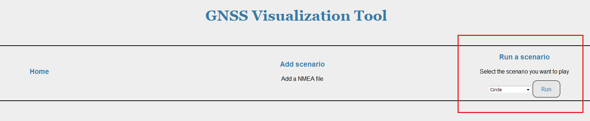
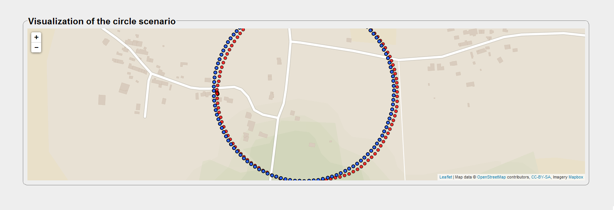
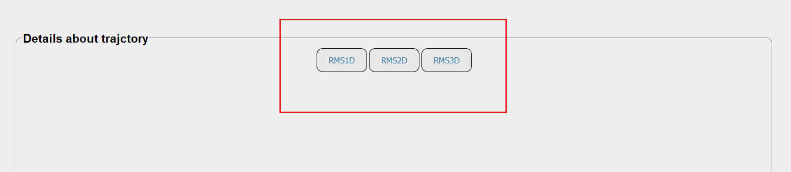
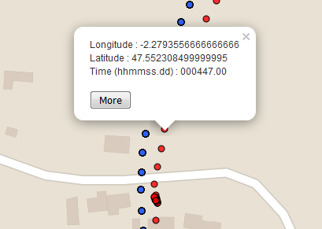
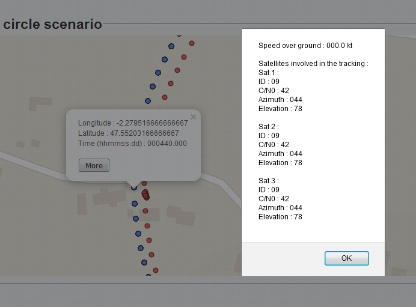

========================
GNSS Visualisation Tools
========================

Launch the application
----------------------

First of all, you have to run the flask.py file. You can find it in GNSS_visualization_tools > GNSSTools >
visualisation > flaskr. This will launch the server on http://127.0.0.1:5000. Then, if you want to get the
home page, just go to http://127.0.0.1:5000/home.

Play a scenario
---------------

Six scenarios are already stored in the database : Circle, Square, Static, Acceleration, Sensivity and
Free to urban tests. You can choose to run any of these in order to visualize the trajectory. You just
have to select it in the list, then click on the "Run" button.

A map appears on the screen, centered on the coordinates where the scenario is played.

There are two differents trajectories for each scenario :

- The blue one represents the estimated position calculated by the receiver

- The red one represents the true position generated by the generator

Avalaible data of the trajectory
--------------------------------

You can have a sight of the Root Mean Square Error of the estimated trajectory. This information is
avalaible :

- in 1D : RMS errors in altitude, longitude and altitude
- in 2D : RMS error in the plan latitude-longitude
- in 3D : RMS error in the space latitude-longitude-altitude

You just have to click on the corresponding button, below the map.

Avalaible data for each point
-----------------------------

You can have a sight of several data of any point of the trajectory. You just have to click on the point
you want. Then a first popup appears, giving two pieces of information :

- The coordinates of the point
- The time when the receiver was at that point
- The latitude and longitude errors of positionning

If you want to learn more, you need to click on th "More" button at the bottom of the popup. A alert window
will appear and you will be given many data :

- The velocity of the receiver at that point
- The ID, elevation, azimuth and C/N0 of any satelite involved in the positionning at that point

How to run your own files
-------------------------

.. note:: The "Add a nmea file" page hasn't been written yet. The associated button isn't linked to any page.
For the moment, there is a esay way to avoid this issue.

You may have remarked there is a "Test" choice in the list of the scenarios. There are likewise two files in the
database : stest_ublox.txt and stest_spectracom.txt. These two files are empty, and dedicated to your own files.
Let's remind that all the stored files have the .txt format and their names begin with a "s".

Thus you have two solutions :

- You can copy/paste the content of your nmea files in these two ones
- You can save your files with the same name "stest_ublox(spectracom).txt" in data > database and erase the empty ones

Don't forget to refresh the web application. Now you can select the "Test" scenario and visualize it on the map.

